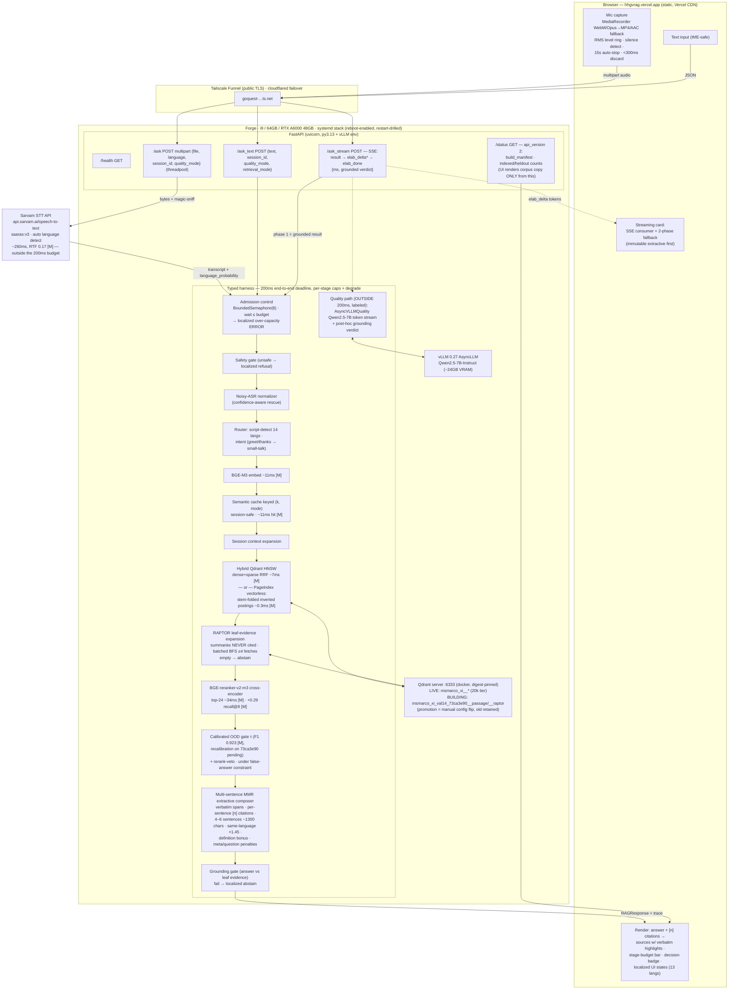

# hhgvrag — Full Pipeline Architecture & Evidence Map

> Status snapshot 2026-08-16 ~11:10Z · versioned build `73ca3e90` RUNNING (RAPTOR phase) ·
> live demo serving throughout from the prior 20k index. Every number below is tagged:
> **[M]** measured on the live system · **[P]** projected/pending re-measurement on the
> 1M-point index. Scope language is binding: *"deterministic validation-split sample —
> 84k source rows, 14 languages, 876k indexed canonical docs, 10.1k held out"* — never
> "full validation".

## 1. Current status (build night)

| Item | State |
|---|---|
| Live demo | https://hhgvrag.vercel.app → Tailscale Funnel → Forge A6000 — **up, unaffected** |
| Versioned build `73ca3e90` | plan ✓ 875,859 docs · passage ✓ **958,999 points exact** (68 min, 0 retries, RSS 5–6GB) · **RAPTOR running** (leaf-copy → ~71k Qwen-3B summaries) · verify ~13:30Z |
| Failures survived | run 1 OOM (38GB accumulation → block-streaming fix) · run 2 upsert timeout (HNSW optimizer stall → retry×5 + 120s timeout + deferred indexing) — each root-caused, fixed, re-authorized |
| After verify | exhaustive qrel verifier (`eval/verify_build.py`, blocks calibration until GREEN) → calibration grid → dev confirmation → sealed test ONCE → manual promotion |
| Human items open | GitHub shell (push armed) · 3 member names for the video kit · post-contest key rotation |

## 2. Complete flow diagram

Response contract (`RAGResponse`): `decision` (ANSWER · ABSTAIN_OOD · ABSTAIN_UNGROUNDED · REFUSE_UNSAFE · ERROR · SMALL_TALK) + answer + citations[] + per-stage `trace` (the latency analytics source) + language. Every fixed message (abstain/refusal/error/greeting/over-capacity) is localized in 13 languages, keyed to detected query language.

## 3. Accuracy measures (design decisions + evidence)

1. **Verbatim extractive default** — answers are exact corpus spans composed by MMR, so fabrication in the official path is structurally impossible; the composer can only select, never generate. [M: composer unit tests + live]
2. **Cite-leaves-only RAPTOR contract** — summaries navigate, leaves testify: retrieval may hit summaries, but they expand to `leaf_descendants` before rerank/gate/compose; empty expansion → abstain; summaries carry no `stable_doc_id`. [M: 30+ named tests, e.g. `test_harness_never_cites_summaries`]
3. **Cross-encoder reranking** — BGE-reranker-v2-m3 over top-24: **+0.29 recall@8** on real qrels vs no-rerank. [M: N=500 real-qrels eval]
4. **Calibrated selective answering** — OOD gate τ fit on labeled scores (F1 0.923 at τ=0.585 on the 20k tier [M]); protocol: recalibrate on the `73ca3e90` calibration partition under an explicit false-answer bound (accuracy first, coverage second), confirm on dev, then seal.
5. **Rerank-veto second gate** — a weak top rerank score vetoes ANSWER even when dense similarity passes: catches near-domain lures. [M: ablation pending CI'd rerun at scale]
6. **Grounding gate** — final answer re-checked against the cited leaf evidence; failure → localized abstain, never a leaked canned answer (the English-IDK leak was found and fixed — empty text now routes to abstain). [M: regression test]
7. **Leakage-safe evaluation identity** — passage-family allocation (exact-hash + SimHash near-dup families, whole families only), `stable_doc_id = SHA256(canonical text + variant)`, 0/0/0 intersections, **byte-identical across two independent planner runs** [M]; absent-evidence holdout is *distribution-matched*, never called "ground-truth OOD".
8. **Sealed-test discipline** — cal/dev/sealed partitions with cross-language query-group co-location (a Hindi variant can never tune what its Tamil sibling tests); sealed IDs redacted to counts+digests in ordinary artifacts; mechanically-enforced one-shot sealed command. [M: artifacts on disk]
9. **Exhaustive post-build verification** — every scored positive must resolve to a leaf in both collections; absent-evidence positives must resolve NOWHERE (realized-index leakage re-proof); missing = build fails closed. [P: runs after verify]
10. **Noise robustness measured, not claimed** — 204-cell grid (langs × SNR × perturbations): zero fabricated answers under noise, en-clean F1 1.000, hi 0.986; the hi-5dB cliff (60%) is published, not hidden. [M]
11. **Same-language evidence preference (×1.45), never a hard filter** — Hindi asker gets Hindi evidence when comparable, but stronger cross-lingual evidence still wins. [M: composer tests]
12. **Honest degradation everywhere** — rerank timeout → veto-conservative fallback; quality-mode failure → `quality_mode=false` in the trace (never silently claimed); streaming elaboration failure → extractive answer stands, labeled unverified.

## 4. Latency measures (design decisions + evidence)

1. **Zero network hops in the hot path** — embedder, Qdrant, reranker, composer co-resident on Forge; the only WAN in the official path is the user's own connection. **P50 51.8ms · P95-under-load 70.6ms · sample-max 78.7ms** (N=43+ live [M]; re-measurement at 1M points is a promotion gate).
2. **Compute-free composition** — the extractive composer is <2ms [M]; no LLM in the official answer path at all.
3. **End-to-end deadline enforcement** — every stage gets `min(stage_cap, remaining_budget)` with a 15ms floor; overruns degrade (skip rerank → conservative gate) rather than blow the budget.
4. **Admission control over collapse** — BoundedSemaphore(8), waiters capped at one full budget: 30-burst = 7 clean answers + 23 honest over-capacity errors in ~200ms each, vs 30/30 hung before [M live drill].
5. **Semantic cache** — (k, mode)-keyed, session-safe: repeat/near-repeat queries ~11ms [M], reported as cache-hit in the trace (latency study only, excluded from quality evals).
6. **Hybrid HNSW at ~7ms** [M] with the **dense-only fusion candidate** from the SOTA audit (+0.21 recall@10 single-run AND −3–5ms by dropping the sparse arm) entering the calibration grid with CIs.
7. **PageIndex vectorless arm** — inverted stem-folded postings over leaves: ~0.3ms retrieval [M]; the "no vector DB" demo mode.
8. **Streaming quality isolation** — the 7B path is SSE-streamed *after* the grounded result event, separately timed, over-budget by design and labeled so; concurrent-stream official-path P95 is a stress gate before public enable.
9. **STT outside the 200ms budget, reported separately** — saaras:v3 ~260ms / RTF 0.17 [M]; voice-turn total = STT + official path, each timed in the trace (terminology lock: P50/P70/P95 percentiles, "sample maximum" never "P100 SLA").
10. **Bulk-ingest isolation** — the index build defers HNSW so live serving never competes with an optimizer storm; build runs in a different conda env, immune to the GPU orphan sweep; live health is checked at every build guard.

## 5. ASR route + audio package (current, precise)

**Route** (`src/stt.py`): `POST https://api.sarvam.ai/speech-to-text` · header `api-subscription-key` (from env-file, never argv) · model **`saaras:v3`**, `mode=transcribe` (saaras-only field) · `language_code` omitted → **auto-detect across the Sarvam language set** · response `{transcript, language_code, language_probability}` → `Transcript{text, language, confidence}`; `confidence = language_probability` feeds the noisy-ASR normalizer layer (widened retrieval + rescue rules at low confidence [M: normalizer rescue rate in the 204-cell grid]).

**Intake** (`/ask`, `src/api.py`): multipart `file` + optional `language`, `session_id`, `quality_mode`, `retrieval_mode`. Deliberately a **sync def** → FastAPI threadpool, so a slow Sarvam call can never freeze the event loop for other users. `_sniff_audio` magic-byte detection (WebM/MP4/WAV/OGG…) chooses filename+MIME for the upstream call — the browser's claimed content-type is not trusted.

**Client-side audio discipline** (`web/index.html` [M: 9 recorder e2e tests]): generation-counted recorder state machine (a stale `ondataavailable` can never attach to a new request), `isTypeSupported` negotiation WebM/Opus → MP4/AAC, RMS silence detection and <300ms discard so **no STT spend on empty audio**, 15s auto-stop, permission-denial and device-loss paths tested.

**Budget/timeout truth**: STT stage cap 8s (config); the HTTP client timeout is currently 15s with the stage cap enforced at thread level — a timed-out stage answers honestly but the HTTP call may linger in its worker thread. **Known limitation, assigned**: Audio-agent P1 tightens HTTP timeout to 6.5–7s (inside the cap), locks the retry taxonomy (timeout/4xx/429 → never retry; single lead-approved 5xx retry), and adds server-side size bounds + codec-aware minimum-duration checks. Until it lands, upload bounding relies on the browser client + threadpool isolation — stated, not hidden.

**Voice E2E numbers** [M]: STT ~260ms (RTF 0.17) + official path P50 ~52ms → spoken-question-to-grounded-answer typically **~320–400ms** wall, reported as separate components in the trace and UI.

## 6. Deployment & operations (evidence-grade posture)

systemd stack (installed + drilled 2026-08-16): digest-pinned Qdrant unit · server unit with `EnvironmentFile` (keys absent from `ps` [M]), Qdrant `/readyz` gate, `KillMode=control-group`, GPU-orphan sweep with `/proc/exe` conda-prefix allowlist (controlled-orphan drill: exact kill, server untouched [M]) · Funnel + cloudflared failover units · health timer · journald caps. **Reboot drill waived — shared production host** (owner directive); service-restart drill passed; claims must distinguish these. Build = transient user unit (linger), phase-durable markers, resource guards (disk/RAM/VRAM/live-health), idempotent restart semantics, leaf-copy resume checkpoint.
